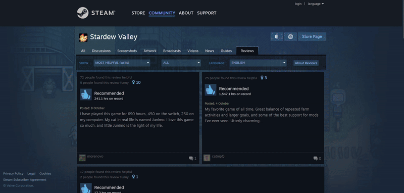

<div align="left">
   <h1>
      Steam Reviews Scraper
   </h1>
   <p>
    This project is created to learn how to use socket.io and Puppeteer for scraping data (game reviews on Steam).<br>
   The number of reviews is limited to 10,000. Simulate means turning on and off chromium to simulate a browser page to scrape data.
   </p>
   
</div>
<br>

<div align="left">
   <h1>
      Installation
   </h>
</div>

```shell
yarn install # install dependencies
yarn dev # start project on localhost:3001

yarn build:css # if CSS does not display or postinstall does not work.
```
 
